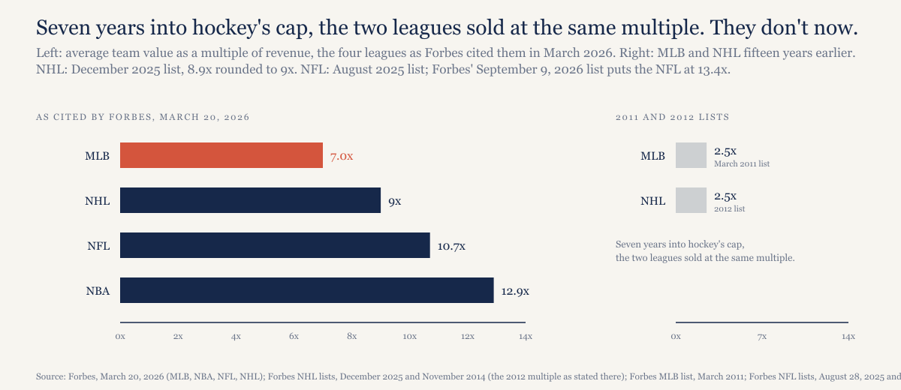
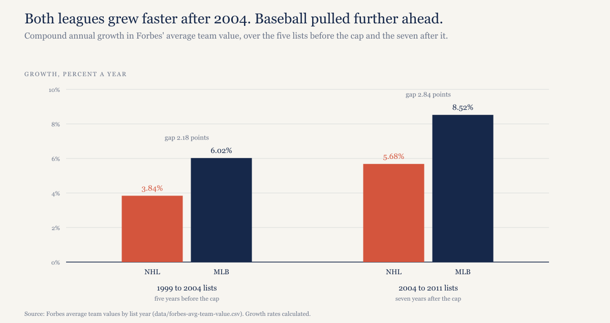
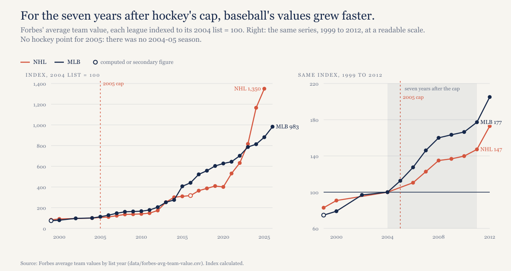
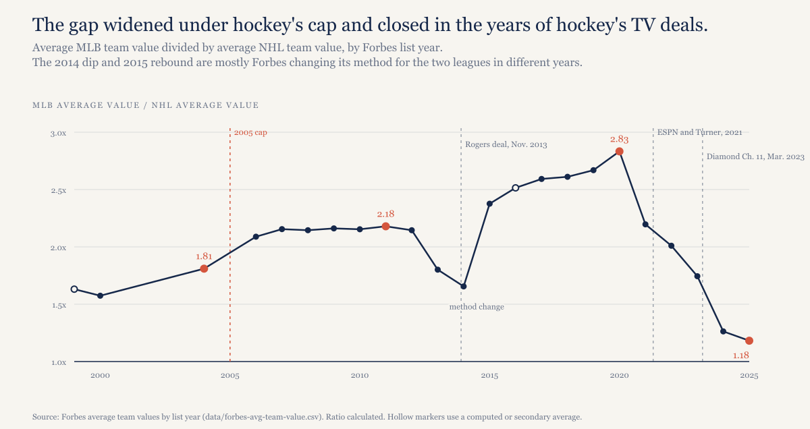

# Baseball's owners want a salary cap. The last league to get one grew slower than baseball for seven years.

*Baseball's owners put a cap on the table on May 28, 2026, and part of their case is that a cap makes franchises worth more. Only one league has adopted a cap inside Forbes' valuation record, the NHL in 2005, so it's the only test that case has. For seven years the test ran the other way.*

---

*Construction note. The values here are Forbes' annual estimates of average team value, not sale prices. Forbes changed its method over the period, moving to enterprise value around 2013, and it lists the two leagues at different times of year: the NHL in November or December, baseball in March or April. Every figure below carries its list year, and "2004" means the 2004 list, which covers the season before it.*

*A few early baseball averages are computed from Forbes' team-by-team tables as reprinted by Sports Business Journal, and the data file flags each one. The 2016 NHL average comes from a secondary report of the Forbes list. There is no NHL list for 2005, because there was no 2004-05 season.*

*One league is not a control group. What follows is a comparison of two series, not a model, and the judgments in it are labeled.*

---

## What the owners asked for, and the argument my friends made

On May 28, 2026, baseball's owners proposed a salary cap for the first time since 1994: $245.3 million for 2027, a $171.2 million floor, players at 50% of revenue, and local media money pooled and split equally in place of the clubs' current revenue-sharing plan, all under a seven-year deal, per the Associated Press that day.

A group of friends I argue baseball with made the case for it this way, and I'm stating it as theirs. Owners want to look like the other leagues because looking like the other leagues drives up franchise values. Expansion means more money to the owners. Baseball lacks a cohesive national TV package and lacks revenue sharing, and a cap is how the other leagues got both.

The gap they're pointing at is real. Forbes' March 20, 2026 list put the average baseball team at $2.9 billion, 7.0 times revenue. The NBA's average multiple was 12.9, the NFL's 10.7, the NHL's 9. The hockey figure is Forbes' December 2025 list rounded up from 8.9, and the football figure is from its August 2025 list; Forbes' September 9, 2026 NFL list has since put the NFL at 13.4x. Baseball is the cheapest major league to buy, per dollar of revenue, and every league above it has a cap.

*[Caption: figures/captions.md, fig-04-multiples]*

So does the cap do it? There's one place in the record to look.

## The clean test: the NHL in 2005

The NHL locked out its players in September 2004, cancelled the whole 2004-05 season on February 16, 2005, and came back in July 2005 with a hard cap: $39 million a team in the first year, a $21.5 million floor, the players' share set at 54% of revenue and rising in tiers to 57%, and every existing contract cut 24%, per the league's own CBA explainer at the time and the Monthly Labor Review's account that December (links in the data section). No other major league has adopted a cap inside Forbes' valuation record. The NFL's dates to 1994 and the NBA's to 1984, before the series starts. Hockey is the only before-and-after we have.

Before the cap, from the 1999 lists to the 2004 lists, the average NHL team went from $135 million to $163 million, 3.84% a year. The average baseball team went from $220.2 million to $295 million, 6.02% a year. Baseball was already outgrowing hockey.

After the cap, from the 2004 lists to the 2011 lists, hockey's average went from $163 million to $240 million, up 47.2%, or 5.68% a year. Baseball's went from $295 million to $523 million, up 77.3%, or 8.52% a year. The gap in annual growth widened: 2.18 points before the cap, 2.84 after it.

*[Caption: figures/captions.md, fig-03-growth]*

*[Caption: figures/captions.md, fig-01-indexed]*

Put it as a ratio. The average baseball team was worth 1.81 times the average hockey team on the 2004 lists and 2.18 times on the 2011 lists. Seven years into the cap, hockey had fallen further behind.

Multiples are the owners' real target, and there the two leagues met. Forbes put baseball at 2.5 times revenue on its March 2011 list. For hockey, Forbes' 2014 list looked back and said the average multiple had been 2.5 two years earlier, on the 2012 list. Seven years into the cap, hockey teams and baseball teams sold for the same multiple of their revenue. The cap hadn't earned hockey a premium.

The cap did do something, and it has to be said. Forbes reported on November 8, 2007 that NHL teams had lost a combined $96 million in the last season before the lockout and made $96 million in the first full season after it. The cap fixed hockey's operating losses. It didn't make hockey teams outgrow baseball's.

## When hockey did catch up

Hockey caught up later, and fast. From the 2012 lists to the 2025 lists, the average NHL team went from $282 million to $2.2 billion, 17.12% a year. Baseball went from $605 million to $2.6 billion over the same lists, 11.87% a year. The ratio of the average baseball team to the average hockey team peaked at 2.83 on the 2020 lists and fell to 1.18 by 2025.

*[Caption: figures/captions.md, fig-02-ratio]*

Hockey's multiple tells the same story: 2.5 times revenue on the 2012 list, 4.0 on the 2014 list, 5.6 on the 2022 list, 8.5 on the 2024 list and 8.9 on the 2025 list.

Here is what happened in those years, as a timeline. On April 19, 2011 NBC signed a 10-year national deal, worth about $200 million a year by the reporting at the time. On November 26, 2013 Rogers announced a 12-year Canadian rights deal it valued at $5.2 billion in total payments, in Canadian dollars, which Forbes credited for the 18.6% jump in average value on its 2014 list. The 2012-13 lockout moved the players' share to 50%. Vegas paid a $500 million expansion fee in 2017 and Seattle paid $650 million, approved by the Board of Governors on December 4, 2018. In 2021 ESPN and Turner took the U.S. rights for about $625 million a year, Turner's $225 million (per Sports Business Journal, as the Boston Globe reported on April 27, 2021) on top of ESPN's roughly $400 million, against about $300 million a year before, by Forbes' December 2021 account. On baseball's side, Diamond Sports Group, which carried 14 baseball teams on its Bally Sports networks, filed for Chapter 11 on March 14, 2023, in the Southern District of Texas, and the regional sports network business that had carried local baseball money for two decades came apart.

My judgment, labeled as such: the catch-up lines up with national television money arriving in hockey and local television money leaving baseball. It doesn't line up with the cap, which hockey had carried for sixteen years before the gap closed. If the cap were the engine, the first seven years should have shown it, and they showed the opposite.

## "Baseball doesn't have revenue sharing"

It does, between clubs. Under the 2022–2026 Basic Agreement, Article XXIV, the revenue sharing plan each year is sized as what a 48% straight pool of the clubs' net local revenue would transfer, and Atlanta Braves Holdings describes the same 48% in its filings with the SEC. Baseball also has a competitive balance tax, with a $244 million threshold for 2026, per MLB's own glossary.

What baseball doesn't have is a fixed player share of revenue. That's what the 50-50 split in the owners' proposal adds, and it's the one piece of the proposal that makes a cap mean anything.

The part of the proposal that looks most like hockey isn't the cap, though. It's pooling local media money, which turns 30 separate television businesses into one league business, the way national deals did for the NHL. If you believe the timeline above, that's the piece that moved hockey's values. Ticket money, the fan's end of the ledger, stays local under the proposal; I wrote about my own share of it last week.

## Expansion

My friends' second point was expansion. The 1998 expansion fee was $130 million a team, per CBS Sports' history of the league's expansions. Rob Manfred floated "more than $2 billion" for the next round in 2021, as ESPN reported. The NHL got $500 million from Vegas and $650 million from Seattle.

Two things about those fees. An expansion fee is a one-time payment to the existing owners, split among them, and it is priced off the franchise values it's supposed to prove. It's a consequence of value, not a cause of it. And in the one league whose agreement I read on this point, the players don't share in it: the NBA's collective bargaining agreement excludes "proceeds from the grant of Expansion Teams and relocation fees" from basketball related income, the pool players are paid from (Article VII of the 2011 agreement). I found nothing in the NHL's 2013 agreement putting expansion fees into hockey-related revenue either. Expansion is an owners' payday under a cap just as it would be without one.

## What the research says

I couldn't find a peer-reviewed study that estimates a cap's effect on franchise values directly. Büschemann and Deutscher, in the International Journal of Sport Finance in November 2011, find that NHL teams' efficiency, measured against team values, improved right after the 2005 agreement, most of all for the weaker teams. Dietl, Franck, Lang and Rathke, in Contemporary Economic Policy in 2012, build a model in which a revenue-based cap raises club surplus. A 2026 Claremont McKenna undergraduate thesis by Cioe estimates a cap premium in value growth for the NFL and NBA; it's an unreviewed thesis, and I'm treating it as one. None of these does what the hockey series does, which is watch the same league's values before and after a cap arrived.

## What would make this wrong

Forbes values are estimates, and the method changed around 2013. The ratio in fig-02 dips to 1.66 on the 2014 lists and jumps back to 2.38 on the 2015 lists, and most of that is the two leagues' methods changing in different years rather than anything that happened on a rink or a diamond.

Hockey started from a distressed base. Percentage growth after 2005 was off teams that were losing money, which could flatter hockey's later growth or depress its early growth, and the comparison can't tell you which.

The two lists come out at different times of year, the Canadian dollar moves a third of the NHL's teams, and expansion changed the denominator of the NHL average twice, in 2017 and 2021.

The NFL and NBA caps predate the series, so hockey carries the whole test. One case is one case.

And the cap may matter through a channel this comparison can't see: lenders and buyers pricing cost certainty into debt and sale terms. If that's where the premium shows up, Forbes' estimates would catch it only slowly and only in part.

## What this predicts

If the next agreement adds a cap but leaves local media where it is, baseball's Forbes multiple stays below the NHL's through the March 2029 list. If it pools local media, the gap closes faster than it did after hockey's cap. Checkable on the 2028 and 2029 lists, and it's going in the predictions log.

## The data

One file and a script, in [`mlb-cap-valuations-2026/`](https://github.com/mgag70-prog/hqsports-research/tree/main/mlb-cap-valuations-2026). `data/forbes-avg-team-value.csv` has Forbes' average team value by list year, NHL 1999 through 2025 and MLB 1999 through 2026, with average revenue and the stated multiple where Forbes published them, a note on how each figure was obtained, and a source URL on every row. `model/recompute_outline.py` computes every growth rate, ratio and index value above from that file.

Take it and check the work. The values are Forbes' and the arithmetic is mine.

Sources beyond the data file: the NHL's 2005 CBA explainer ([nhl.com, archived](https://nhl.com/ice/page.htm?id=26366)) and the [Monthly Labor Review, December 2005](https://www.bls.gov/opub/mlr/2005/12/art3full.pdf); [Forbes, November 8, 2007](https://www.forbes.com/2007/11/08/nhl-team-values-biz-07nhl_cx_mo_kb_1108nhlintro.html) for the $96 million figures; [NBC Sports, April 19, 2011](https://nhl.nbcsports.com/2011/04/19/nhl-and-nbc-sports-group-sign-10-year-broadcast-deal/); [Rogers, November 26, 2013](https://about.rogers.com/news-ideas/rogers-communications-and-nhl-announce-12-year-national-broadcast-and-multimedia-agreement/); [the Boston Globe, April 27, 2021](https://www.bostonglobe.com/2021/04/27/sports/turner-sports-nhl-announce-seven-year-broadcast-rights-deal) and [Forbes, December 8, 2021](https://www.forbes.com/sites/mikeozanian/2021/12/08/nhl-team-values-2021-22-new-york-rangers-become-hockeys-first-2-billion-team/) for the U.S. television money; [CBS Sports](https://www.cbssports.com/mlb/news/mlb-expansion-what-to-know-about-plans-fees-possible-locations-more-as-league-looks-to-add-two-new-teams) and [ESPN](https://www.espn.com/mlb/story/_/id/31346969/expansion-fees-major-league-baseball-teams-rise-22-billion-range) on expansion fees; [MLB's glossary](https://www.mlb.com/glossary/transactions/competitive-balance-tax) for the tax threshold; [Forbes' NFL lists of August 28, 2025](https://www.forbes.com/sites/justinteitelbaum/2025/08/28/the-nfls-most-valuable-teams-2025/) and [September 9, 2026](https://www.forbes.com/sites/justinteitelbaum/2026/09/09/the-nfls-most-valuable-teams-2026/) for the 10.7x and 13.4x; and the three studies: [Büschemann and Deutscher](https://ideas.repec.org/a/jsf/intjsf/v6y2011i4p298-306.html), [Dietl, Franck, Lang and Rathke](https://www.zora.uzh.ch/entities/publication/81b2cfb7-34f0-4780-afa5-b0a576bbf844), and [Cioe](https://scholarship.claremont.edu/cmc_theses/4212).

---

## Not for publication: alternate titles

1. The NHL got its salary cap in 2005. For the next seven years, baseball teams gained value faster.
2. Baseball owners want hockey's salary cap. Hockey's cap didn't close the value gap. TV money did.
3. A salary cap didn't make hockey teams worth more. Baseball's owners are betting it will.

The first alternate was the working H1 until October 4, 2026. The second states the television judgment as fact in the title; the body labels it as judgment.
