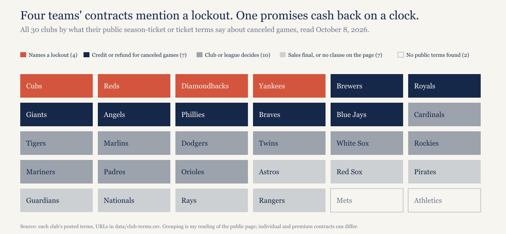
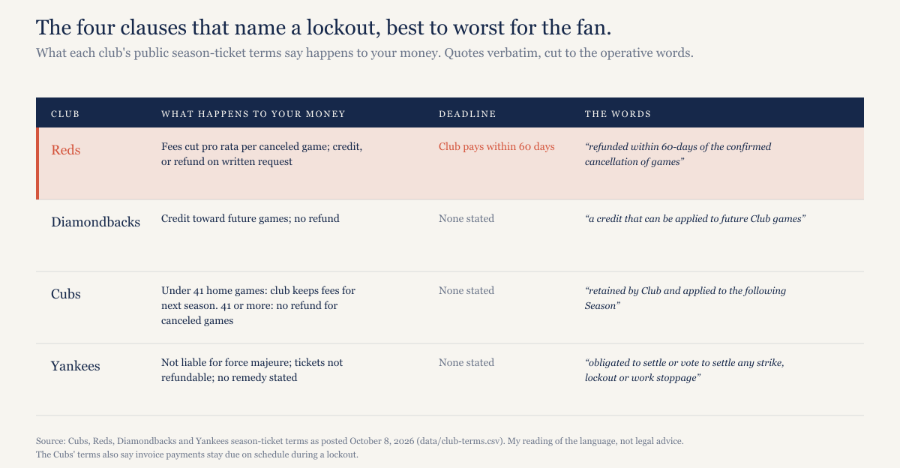
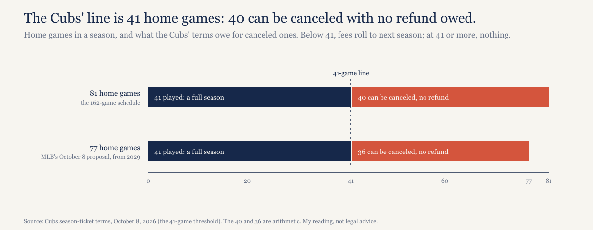
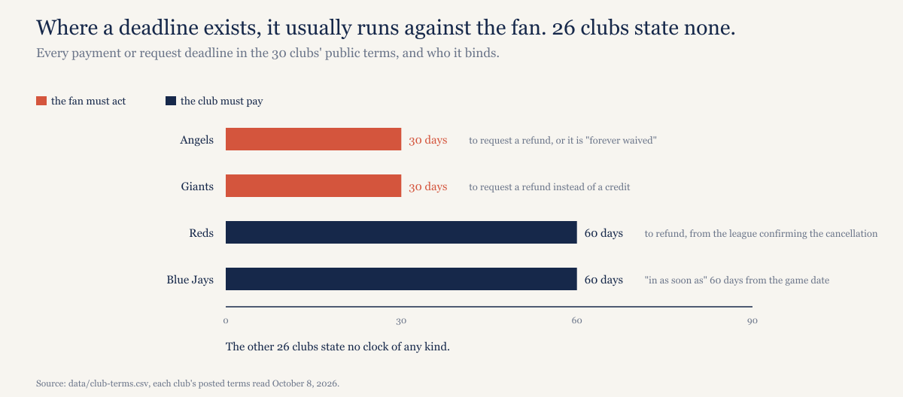

# Four MLB teams' season-ticket contracts mention a lockout. Only one promises your money back.

*The CBA expires at 11:59 p.m. ET on December 1, and renewal invoices for 2027 are already out. I read the public season-ticket terms of all 30 clubs to see what each one says happens to the money if games are canceled. Most say nothing.*

---

*Construction note. Everything below comes from the public season-ticket or ticket terms each club posts on its own site, as they read on October 8, 2026. Individual contracts, premium seating and suite agreements can differ from the public page, and for some clubs the only public document is the general single-game ticket terms rather than a season-ticket agreement; the data file labels each. This is my reading of contract language, not legal advice. Every quote is checked by script against the saved page text.*

*Disclosure: I held Cubs season tickets from 1998 to 2021 and gave them up over how the 2020 refunds were handled. [I wrote that up last week.](https://ledgerandwhistle.substack.com/p/i-paid-for-the-same-four-wrigley)*

---

## The question on the invoice

The collective bargaining agreement runs out at 11:59 p.m. ET on December 1, 2026. Renewal invoices for 2027 went out before that date, as they do every year, and most of them ask for money now for games in April. If the owners lock the players out on December 2 and the stoppage runs into the season, what does the contract you signed say happens to that money?

I read all 30 clubs' public terms to find out. Four of them mention a lockout or strike at all. Seven more promise a credit or refund for canceled games without saying what caused the cancellation. The other 19 leave it to the club, say sales are final, or have no public terms I could find.

*[Caption: figures/captions.md, fig-01-club-grid]*

## The four that name a lockout

From best to worst for the fan.

**Reds.** The only club that names a lockout and puts a clock on its own payment. Fees are cut pro rata for each canceled home game, and the holder can take a credit or, on written request, a refund "refunded within 60-days of the confirmed cancellation of games by the Office of the Commissioner of Major League Baseball."

**Diamondbacks.** A credit, and only a credit: "Club shall provide Member with a credit that can be applied to future Club games." No refund, no deadline.

**Cubs.** Invoice payments stay due on schedule whether or not there's a lockout. If fewer than 41 home games are played, the club keeps the money: "any fees paid by Licensee shall be retained by Club and applied to the following Season," with the license extended a year. If 41 or more are played, the terms treat it as a full season, and the force majeure paragraph, which names lockouts, says no refund is owed for the games that weren't. More on that line below.

**Yankees.** The club isn't liable for delays caused by force majeure, tickets aren't refundable, and the club is not "obligated to settle or vote to settle any strike, lockout or work stoppage or other labor disturbance." No remedy is stated.

*[Caption: figures/captions.md, fig-02-lockout-table]*

## The Cubs' 41-game line

A baseball season has 81 home games. The Cubs' terms turn on whether 41 of them are played. Read as written, up to 40 home games can be canceled in a lockout and the season still counts as full, with no refund and no credit for the games that weren't played. One fewer than that and the club keeps the money anyway, rolling it into the next season.

MLB's proposal of October 8 would cut the schedule to 154 games from 2029, which is 77 home dates. The same 41-game line against a 77-game schedule allows 36 cancellations before anything changes. The line in the contract doesn't move with the schedule.

*[Caption: figures/captions.md, fig-04-cubs-line]*

I'm reading the paragraph as it's written. The Cubs may well do more than it requires if games are lost; the point is what the document commits them to: below 41 games, your money rolls into next season; at 41 or more, nothing for the games that weren't played.

## Seven that promise something for canceled games

Seven clubs' public terms promise a credit or a refund for games canceled and not rescheduled, without naming a lockout or any other cause.

The Brewers and Royals use the same sentence: "For any cancelled games that are not replaced or rescheduled, account holders will receive an account credit or a refund equal to the paid value of the relevant tickets and parking." The Giants default to a credit, and "if Account Holder prefers a refund instead of a credit, may request one within thirty (30) days of the cancellation." The Angels put a harder edge on the same clock: "Refunds must be requested within thirty (30) days of the announced cancellation of the Event or the refund is forever waived." The Phillies issue credit, and cash only after a holder opts out of renewing. The Braves' and Blue Jays' general ticket terms refund automatically to the card, with no credits; at the Blue Jays the holder "will be automatically refunded for the amount paid on account of this ticket in as soon as sixty (60) days from the Game date."

None of these clauses was written for a labor stoppage, and most of these contracts carry force majeure language elsewhere that a club could try to read against them. I'm reading them as written. A canceled game is a canceled game.

## The other nineteen

Ten clubs leave the remedy to themselves or to the league. The Tigers' terms say that "if not rescheduled/resumed, refunds or credits will be as determined in Club’s discretion"; the Marlins' that "the MLB Entities will determine in their sole discretion whether any refunds will be issued"; the Cardinals' that a ticket follows the host's announced policy for the event; the Dodgers' that a canceled game's ticket is exchanged for a future one, with no cash. The Twins and White Sox point to policies posted elsewhere on their sites, and the Rockies' public terms are a rain-check exchange within the season. The Mariners, Padres and Orioles each say the club is "not responsible for refunding all or any portion of your Membership fees," and their public pages don't say what happens to the tickets themselves.

Seven say sales are final or have no canceled-game clause on the public page: the Astros, Red Sox ("ALL TICKET SALES ARE FINAL AND NO REFUNDS WILL BE MADE."), Pirates, Guardians, Nationals, Rays and Rangers. Three of those spell out a remedy only for unplayed postseason games.

Two clubs, the Mets and Athletics, have no public season-ticket terms I could find at all.

## Who owes the deadline

Where a deadline exists, it's more often on the fan than on the club. The Angels and Giants give the fan 30 days to ask. The Reds give themselves 60 days to pay. The Blue Jays say "as soon as" 60 days. The other 26 clubs state no payment clock of any kind.

*[Caption: figures/captions.md, fig-03-refund-clocks]*

## What happened last time

The 2021-22 lockout ran from December 2, 2021 to March 10, 2022. The Brewers gave credit or a refund, parking included; the Reds credited accounts automatically. Every lost date was made up and the full 162-game season was played, so no club's clause for games canceled and not rescheduled was ever triggered. That's the part worth holding onto: none of the language above has been exercised in a lockout. The last one ended before it had to be.

## What to do

Read your terms, the ones on your club's site and the ones in your renewal packet, and find the paragraph on canceled games. Note any deadline that runs against you; two clubs give you 30 days from the announcement, and a missed window at one of them means the refund is "forever waived." Then ask your rep, in writing, which clause the club will apply if a lockout cancels games. Keep the answer.

## What would make this wrong

The public page may not be the contract you signed. Season-ticket agreements get amended by letter, premium and suite terms differ, and a club can post new terms between now and December. Ten of the 30 documents are general ticket terms rather than season-ticket agreements, and for the Athletics I found only a sales page; the data file says which.

The reading is mine. A court or an arbitrator could read a force majeure clause as overriding a canceled-game clause, or the other way. I've read each page as written and said where that leaves the fan.

I haven't checked whether the Cubs' lockout language is new. A Wayback comparison against the 2021 terms would settle it, and I'll do it after publication rather than guess now.

## What this predicts

If regular-season home games are canceled in 2027, no club whose terms let it keep the money changes those terms during the stoppage, and where refunds happen, they take longer than 60 days for most fans. Checkable against the clubs' own announcements and against readers' accounts.

## The data

`data/club-terms.csv` has one row per club: the document read, its category, whether it names a lockout, the remedy for canceled games, any timing, one verbatim quote, the URL and the fetch date. `model/build_terms_table.py` rebuilds that file and fails if any quote isn't found word for word in the saved page text. The four lockout clauses: [Cubs](https://www.mlb.com/cubs/tickets/season-tickets/holders/terms-and-conditions), [Reds](https://mlb.com/reds/tickets/info/terms-conditions/regseason-agreement), [Diamondbacks](https://www.mlb.com/dbacks/tickets/season-tickets/terms-conditions), [Yankees](https://www.mlb.com/yankees/tickets/season-tickets/terms-and-conditions). The other 26 URLs are in the file.

---

## Not for publication

Alternate titles:

1. Read your season-ticket contract before December 1.
2. If baseball locks out, here's what 30 teams say happens to your season-ticket money.

Open items: the prediction wording in "What this predicts" is marked for Matt; the Wayback check of the Cubs' 2021 terms is not done; the 2021-22 lockout facts (dates, Brewers and Reds handling) are from the project memo, not from the data file; the October 8 154-game proposal is cited from the outline.
