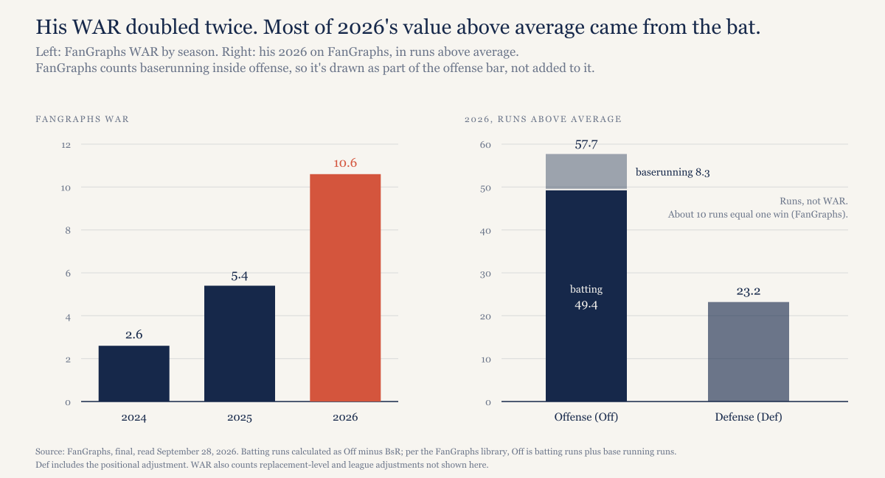
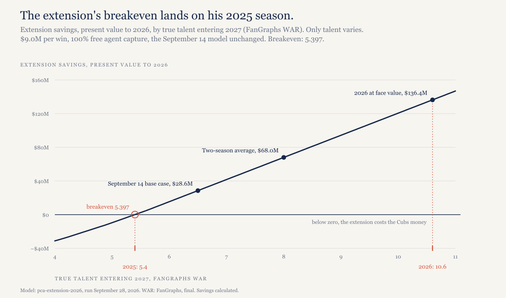
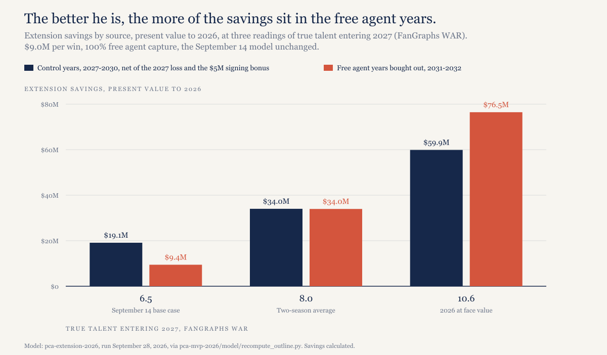
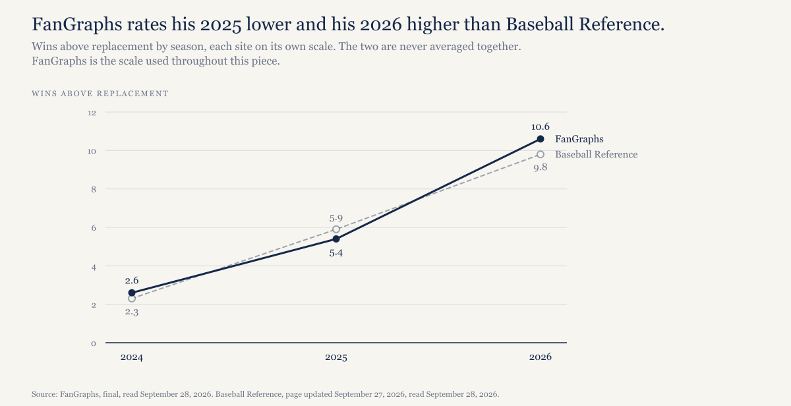

# If Pete Crow-Armstrong were still the 2025 player, his extension would break even. He isn't.

*His MVP season can't pay the Cubs anything, because the contract doesn't start until 2027. What it does is settle the one input the September 14 model was most sensitive to.*

---

*Construction note. The model is the one I published September 14, unchanged, and only one input moves: true talent entering 2027. Everything else stays where it was. That means $9.0 million per win in 2027, inflating 3% a year, a 6% discount rate, arbitration at 25%, 40% and 60% of open-market value, a $1.0 million pre-arbitration salary for 2027, the same aging curve, and a hypothetical eight-year free agent deal covering ages 29 through 36 at 100% of projected value.*

*WAR is FanGraphs throughout, matching the September 14 piece, which cited his FanGraphs numbers. I should be plain about one thing: the 6.5 true-talent figure in that piece was my own regressed estimate, not a number from any source, and I never recorded which WAR scale it was meant on. I'm treating it as FanGraphs now. Baseball Reference WAR appears only in the section on what would make this wrong, labeled, and it's never averaged with FanGraphs.*

*Season stats come from Baseball Reference, final, page updated September 27, 2026 at 11:50 p.m. FanGraphs WAR is final as of September 28.*

---

## The season

Crow-Armstrong played all 162 games and hit .280/.372/.570 in 726 plate appearances, with 45 home runs, 107 RBI, 119 runs and 41 steals in 48 attempts, good for a 156 OPS+. The 45 homers tied Kyle Schwarber for the major league lead. He reached 40/40 on September 24 against Miami, the night the Cubs clinched a postseason berth; that made him the first Cub to do it and the seventh player in major league history. On Sunday he singled to open the finale and came out for a pinch runner.

On FanGraphs his WAR went from 2.6 in 2024 to 5.4 in 2025 and 10.6 this season. FanGraphs has him 57.7 runs above average on offense this year and 23.2 on defense. The offense figure already contains his 8.3 runs of baserunning, so take those out and batting alone comes to 49.4 runs.

*[Caption: figures/captions.md, fig-01-season]*

Everyone ran the 40/40 story Thursday. It isn't why I'm writing this.

## What the season is worth under the contract

Nothing. The extension covers 2027 through 2032, so 2026 got paid at the pre-arbitration rate whether he signed or not.

The MVP escalators don't reach back either. According to the contract details Bob Nightengale reported in March, they key off voting in 2027 through 2031. Each MVP in 2027 through 2030 adds $2 million to his 2031 base, and each MVP in 2027 through 2031 adds $2 million to his 2032 base, with smaller bumps for finishing lower: $1 million for second or third, $750,000 for fourth or fifth, $500,000 for sixth through tenth. A 2026 MVP triggers none of it.

The September 14 model left the escalators out, so here's the most they could cost. If he wins every MVP the contract counts, the 2031 salary goes up $8 million and the 2032 salary $10 million. Discounted to 2026 at the model's 6%, that's $13.0 million. My judgment is that this matters less than the raw number suggests, because a player who keeps winning MVPs is one whose true talent sits in the top rows of the table below, where the savings run from $68.0 million to $136.4 million. I haven't modeled that pairing, and I'm labeling the claim as a read, not a result.

So the Cubs already paid for this season. What they got for it is information.

## The one input that moves

The September 14 piece found that extension savings were more sensitive to true talent than to anything else in the model. Here's the same model run at four readings of it, holding $9.0 million per win and 100% capture fixed:

| Reading (fWAR) | True talent entering 2027 | Extension savings (NPV) | Surplus value (NPV) |
|---|---|---|---|
| His 2025 season | 5.4 | $0.1M | $153.7M |
| September 14 base case | 6.5 | $28.6M | $205.9M |
| Two-season average of 5.4 and 10.6 | 8.0 | $68.0M | $277.1M |
| 2026 taken at face value | 10.6 | $136.4M | $400.6M |

*[Caption: figures/captions.md, fig-02-savings-curve]*

Savings, remember, is the column that answers whether signing him was a good decision: what the Cubs pay under the extension against what they'd have paid without it. Surplus value is what he produces over what he's paid, and it's large at every row because a good young player on a fixed salary is always a bargain in that sense. The September 14 headline was the gap between those two columns, and it's still there.

What drives the savings column is the counterfactual. Without the extension, he'd have hit free agency after 2030, and the model prices his 2031 and 2032 seasons at the average annual value of an eight-year deal starting at 29. That AAV is $24.4 million if he's a 5.4-win player and $36.5 million at 6.5. At 8.0 it jumps to $53.4 million, and at 10.6 it's $82.7 million. A better player costs more in every arbitration year and far more as a free agent, and in March the Cubs fixed both prices before anyone knew which player they had.

## The breakeven is his 2025 season

Solve for the talent level where the extension saves exactly nothing and you get 5.397 wins. His 2025 season on FanGraphs was 5.4.

Put another way, if Crow-Armstrong were exactly the 2025 player for the next six years, the deal would be a wash, $0.1 million in the Cubs' favor. Each win of true talent above that adds about $26 million in savings; between the rows of the table the slope runs from $25.9 million to $26.3 million per win.

I don't want to make more of that match than it deserves. Nobody designed the model so that 2025 would land on the breakeven; it falls out of the dollars-per-win, discount and arbitration inputs, and a small change to any of them would move the zero crossing off 5.4. But it does make the question clean. Before this season, the whole case for the extension came down to whether he was better than his 2025. This season is the evidence that he is.

Why not take 10.6 and call it $136.4 million? One season is a sample, and true talent is what you'd expect from him next year, which is a different thing. The September 14 model regressed his numbers on purpose, and I'm not going to drop that the first time the numbers get exciting. The 8.0 row is plain arithmetic, the average of two seasons, not a projection system. I think it's a more defensible reading than 6.5 now, but that's judgment. The 10.6 row is there to show the ceiling, and I wouldn't forecast from it.

## Where the savings come from now

This is the part of the September 14 piece that needs updating. At 6.5 true talent, most of the savings came from the four control years: $19.1 million net for 2027 through 2030, against $9.4 million for 2031 and 2032, the two free agent seasons the extension bought out.

At 8.0 the control years and the free agent years are tied at $34.0 million each. At 10.6 the free agent years lead, $76.5 million to $59.9 million.

*[Caption: figures/captions.md, fig-03-savings-split]*

The reason is that a better player raises the 2031 free agent counterfactual more than it raises his arbitration awards. Arbitration pays him only 25%, 40% or 60% of his value, so when the value goes up, the award goes up by that share. The free agent AAV carries his full projected value, averaged over an eight-year deal. In this model each added win of true talent adds about $16 million to the free agent years' savings and about $10 million to the arbitration years'.

2027 doesn't respond to talent at all. The extension pays him $10 million where a renewal would have paid $1.0 million, a $9.0 million loss that season however good he is, and the control years also absorb the $5 million signing bonus. That was true on September 14 and it's true now.

So the September 14 finding described the player the Cubs thought they were signing in March. If he's the 8.0 player the two-season average suggests, the two bought-out free agent seasons carry as much of the extension's value as the four control years, and if he's better than that, they carry more.

## What would make this wrong

The WAR scale matters. Baseball Reference has him at 2.3 in 2024, 5.9 in 2025 and 9.8 in 2026 (read September 28, 2026, from the same page as the season line). The last two average 7.85, which puts the savings at $64.0 million, close to the FanGraphs figure. The breakeven point is weaker on that scale, though, because his 2025 clears 5.397 by half a win instead of landing on it. I'm mentioning it so nobody thinks I picked the scale that made the chart look good; I picked the one the September 14 piece used.

*[Caption: figures/captions.md, fig-04-war-scales]*

The aging curve might be too steep. The model has him declining after 27, faster than a typical slugger, because his value leaned on defense and speed, which age badly. With 45 home runs and 49.4 batting runs this year, his offense figure less its baserunning, more of his value now comes from the bat. If that holds, the curve is too pessimistic and the savings in the table are understated. That's a judgment I haven't modeled.

Then there's the labor fight. The CBA expires at 11:59 p.m. ET on December 1, 2026, and the owners' proposed $245.3 million cap for 2027 would change dollars per win and the free agent counterfactual at the same time. Both sit at the center of this model. [The 1994 base-rate piece](https://ledgerandwhistle.substack.com/p/baseballs-first-two-strikes-recovered) covers what a stoppage has cost before.

Injury risk and the chance of a career-ending event live in the September 14 Monte Carlo, not in the deterministic table here. I haven't rerun the simulation at 8.0, so I'm not quoting a median or a probability for it.

## What this predicts

Watch his 2027 fWAR. At 6.5 or better, the September 14 base case was conservative and the savings are larger than I published. At 5.4 or worse, the extension is roughly a wash and 2026 was the outlier. I'll check it against his final 2027 line here, and it's going in the predictions log.

## The data

Same model, same repo, one new input. The September 14 model is in [`pca-extension-2026/`](https://github.com/mgag70-prog/hqsports-research/tree/main/pca-extension-2026), and the script that produced every figure in this piece is in [`pca-mvp-2026/model/`](https://github.com/mgag70-prog/hqsports-research/tree/main/pca-mvp-2026/model). It imports the original model rather than copying it, so the numbers above can't drift from the ones published September 14. Credit again to Adam Niedbalski, whose September 14 piece prompted [the original one](https://signalhunterai.substack.com/p/the-cubs-saved-29-million-on-pete).

---

## Not for publication: alternate titles

1. Pete Crow-Armstrong's MVP season earned the Cubs nothing under his contract. It changed what they think they own.
2. The Cubs didn't get a dollar from Pete Crow-Armstrong's MVP year. They got an answer to the one question the extension depended on.
3. Pete Crow-Armstrong's extension breaks even at exactly his 2025 season. 2026 says he's past it.
