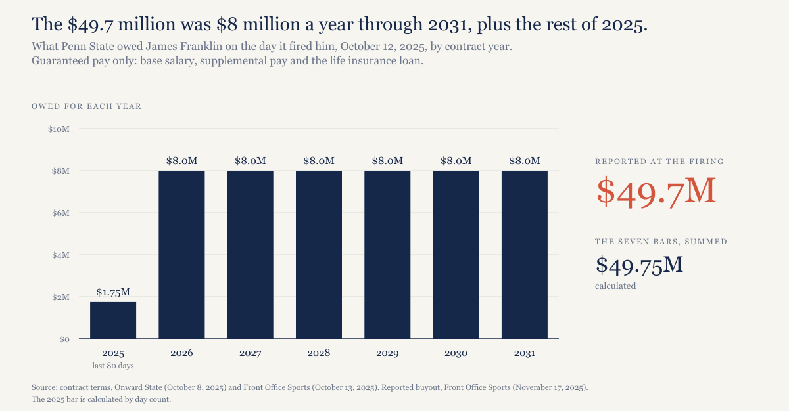
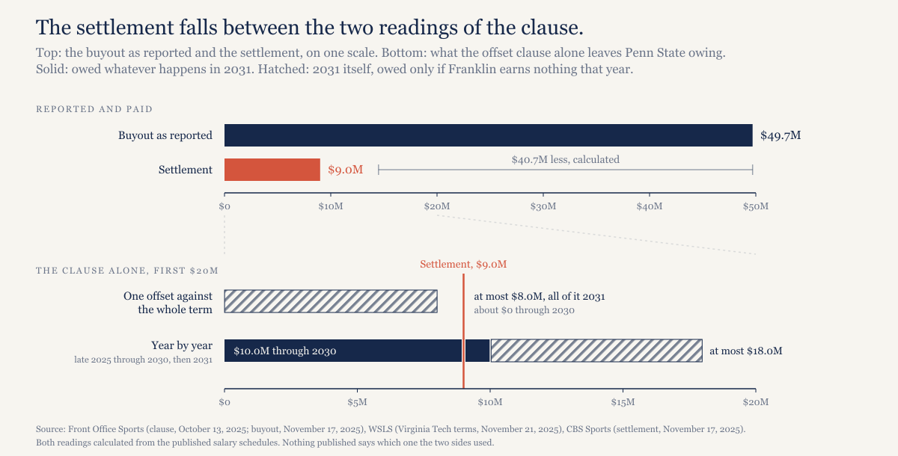
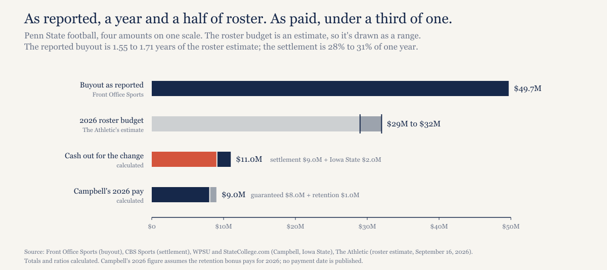

# Penn State's $49.7 million buyout cost $9 million. The contract said it would.

*Buyouts get reported at their maximum. What a school pays depends on an offset clause and on what the next school pays the coach, and at Penn State the clause did nearly all of the work.*

---

*Construction note. Nobody has published the settlement between Penn State and James Franklin, and its $9.0 million figure comes from unnamed sources: Jon Sauber of the Centre Daily Times reported it first on November 17, 2025, and CBS Sports and Sports Illustrated followed. The contracts are better documented than that. Front Office Sports obtained Franklin's 2021 Penn State contract and quoted its offset clause on October 13, 2025. Virginia Tech and Penn State each released terms for the deals that came after, and I have those through WSLS, Sports Illustrated, StateCollege.com, Onward State and WPSU. I haven't read any of the three contracts myself.*

*The size of the original buyout depends on who counted and when. Sports Illustrated, citing Front Office Sports, had $56.66 million just before the firing. Onward State had $56 million for an in-season firing, which counts all of 2025 including pay he'd already received; CBS Sports used $49 million; SI later described it as $48 million plus the rest of his 2025 salary. Front Office Sports and USA Today put it at $49.7 million, and that's the figure I use. Every version comes out of one formula, $8 million for each contract year remaining.*

*The two offset calculations in the third section are my arithmetic on the published salary schedules. They show what the clause would have produced under each reading of it. They don't show what the two sides negotiated, or why.*

---

## The number everyone quoted

Franklin's 10-year extension took effect in January 2022 and guaranteed him $8.0 million a year: $500,000 in base salary, $6.5 million in supplemental pay and a $1 million loan for life insurance, according to Onward State's October 8, 2025 breakdown of terms the Centre Daily Times had published. He also collected a $500,000 retention bonus every December 31 he was still employed (CBS Sports, October 11, 2025), which is why Front Office Sports lists his last Penn State salary as $8.5 million. The bonus sat outside the buyout.

The buyout itself was simple, if Penn State fired him without cause, it owed the $8.0 million for every year left through 2031, so the number fell by $8 million each January 1.

Penn State fired him on Sunday, October 12, 2025, less than 24 hours after a 22-21 home loss to Northwestern dropped a team that had started the season ranked second to 3-3 (Fox Sports). Six full years remained, worth $48.0 million, plus the last 80 days of 2025. By my day count that stub comes to $1.75 million and the total to $49.75 million; the reported figure was $49.7 million.

At his press conference the next day, athletic director Pat Kraft said who would carry it. "This is an athletics issue, this is not the institution's issue," he said, as Front Office Sports quoted him. "We in athletics are covering all the costs." That's the same department paying for the Beaver Stadium renovation, which the trustees approved in May 2024 at no more than $700 million, with no tuition dollars or educational budget money in it, per Penn State's own announcement.

*[Caption: figures/captions.md, fig-01-buyout-schedule]*

## What Penn State actually paid

Virginia Tech hired Franklin on November 17, 2025, 36 days after the firing. That same day the reports had Penn State and Franklin settling the old contract for $9.0 million. Onward State, citing Sauber, called it a flat payment, and Front Office Sports reported that the settlement removes the offset language from the deal. Whether Penn State pays it at once or in installments, nobody has said.

Front Office Sports and CBS Sports both rounded the savings to $40 million. Against $49.7 million the gap is $40.7 million, which is my subtraction and not a reported figure.

The coverage framed it as a negotiation. CBS Sports wrote on November 17 that Penn State had negotiated "a dramatic reduction" while the Virginia Tech talks heated up, and its April 16, 2026 story ran under a headline about Franklin leaving $40 million on the table. That story drew on a USA Today interview in which Franklin said he wasn't thrilled to hand his old employer a break that size. He explained the move anyway: "They wanted us. That's powerful. Money can't replace that."

He was never going to collect most of that money once he took a job, though, and the reason is in the contract.

## What the contract said

Front Office Sports published the clause the day after the firing. If Franklin took another job before the contract would have expired, Penn State's obligation to pay him "will be offset by the total compensation earned by Coach from such applicable new position through the end of the otherwise unexpired term of this agreement." A second passage made him look for that job: he was "obligated to diligently search for and make a good faith effort to obtain another position appropriate for his skill set (i.e., coaching, scouting and broadcasting only)," and had "to make good faith efforts to obtain the maximum reasonable salary" once he found one.

So the bill turns on what Virginia Tech pays him. The school released those terms on November 21, 2025, and WSLS reported them: a contract effective November 15, 2025 and running through December 31, 2030, worth $41.75 million, with a $500,000 base salary and supplemental pay of $5.5 million in 2026, $4.5 million in 2027, $3.5 million in 2028, $12.25 million in 2029 and $12.75 million in 2030. Sports Illustrated describes the deal as fully guaranteed.

Add base to supplemental and the five full years pay $6.0 million, $5.0 million, $4.0 million, $12.75 million and $13.25 million, or $41.0 million together. The other $0.75 million is 2025. The contract pays the $6.0 million rate pro rata from November 15, and a month and a half at that rate is $0.75 million; no source publishes the prorated amount, so that last step is mine.

The clause can be applied two ways, and the published excerpt doesn't settle which one governs.

**One offset against the whole term.** I read "total compensation" earned "through the end of the otherwise unexpired term" as a single sum: everything Penn State owed from the firing through 2031, less everything the new job pays over the same stretch. Penn State owed $49.75 million and Virginia Tech's contract pays $41.75 million, which leaves about $8.0 million. All of it is 2031, the one year the Virginia Tech contract doesn't reach, and anything Franklin earns that year, from Virginia Tech or anyone else, would come off too.

There's a detail inside that reading I'll report without leaning on it. Between the day after the firing and the end of 2030, Penn State's guaranteed pay comes to $41.753 million by my day count, and the Virginia Tech contract is $41.75 million. That's an observation. A different proration convention moves my side by ten or twenty thousand dollars, and nothing published says anyone built the contract to hit the number.

**Year by year.** The other way is one period at a time: in each year Penn State owes its $8.0 million less whatever Virginia Tech pays that year, and never less than zero, so a big Virginia Tech year can't reach back and cancel a small one.

| Year | Virginia Tech pays | Penn State owes | Franklin's total |
|---|---|---|---|
| 2026 | $6.0M | $2.0M | $8.0M |
| 2027 | $5.0M | $3.0M | $8.0M |
| 2028 | $4.0M | $4.0M | $8.0M |
| 2029 | $12.75M | $0 | $12.75M |
| 2030 | $13.25M | $0 | $13.25M |

That's $9.0 million for 2026 through 2028. The 80 days of 2025 after the firing add about $1.0 million more, 33 days with no offsetting job and then 47 days at the $2.0 million gap between Penn State's rate and Virginia Tech's, for a total near $10.0 million. On top of it sits the same 2031 exposure as before: up to $8.0 million if he earns nothing that year.

For three years under this reading, Virginia Tech's pay plus Penn State's offset equals $8.0 million, his guaranteed Penn State pay; the $500,000 retention bonus was never part of it. Virginia Tech's contract runs low in exactly the years Penn State would have been paying and jumps in 2029, when Penn State's share would hit zero. FootballScoop quoted a source with direct knowledge on November 21, 2025, saying "He isn't getting a penny less" than Penn State would have paid him. Did somebody build the back-loading around the clause? I can't say from the outside, and a back-loaded deal also suits a school that wants its early cash costs low, so the shape alone proves nothing.

Here are both readings beside what Penn State paid.

| | Whole-term offset | Year-by-year offset |
|---|---|---|
| Owed through 2030 | about $0 | $10.0M |
| 2031, if he earns nothing that year | $8.0M | $8.0M |
| Total with nothing earned in 2031 | $8.0M | $18.0M |
| Settlement | $9.0M | $9.0M |

*[Caption: figures/captions.md, fig-02-two-readings]*

What I take from it: under the first reading the clause by itself caps Penn State's bill near $8.0 million, and under the second it sets the bill at about $10.0 million with as much as $8.0 million more hanging on a season five years off. The settlement lands between the two and closes the 2031 question under both. So most of the fall from $49.7 million was the contract doing what it said it would do once Franklin took a job. Of the $40.7 million drop, the clause alone accounts for $39.7 million under the second reading, and under the first it would have gone a little past the settlement, to $41.7 million. Under the whole-term reading, Penn State's maximum possible exposure was $8.0 million, so the $9.0 million settlement was about $1.0 million above it (calculated); under the year-by-year reading, the settlement was about $1.0 million below the least Penn State could have owed, and further below if 2031 had gone unpaid. I can't tell which reading the two sides used, because the settlement isn't public.

One more piece of arithmetic. If Virginia Tech pays its contract in full, Franklin collects $41.75 million there and $9.0 million from Penn State, $50.75 million in all, which is about a million more than the buyout everyone quoted. He has to coach for it.

## Penn State kept the clause

A Penn State trustees committee approved Matt Campbell's contract on December 8, 2025. It runs eight years, through 2033, with guaranteed pay of $8.0 million in 2026, $8.25 million in 2027, $8.5 million in 2028, $9.0 million in 2029 and 2030, and $9.25 million in each of the last three years, per the term sheet as StateCollege.com and Sports Illustrated reported it. That's $70.5 million. A $1 million retention bonus for each contract year brings it to the $78.5 million WPSU reported. Penn State also agreed to pay Iowa State $2.0 million toward Campbell's buyout there, and StateCollege.com says Campbell covered the rest himself.

If Penn State fires him, the term sheet says it will pay 100% of his remaining guaranteed compensation "for the remainder of the employment agreement, subject to mitigation," in SI's quotation of it. Same mechanism. The clause that turned $49.7 million into $9.0 million is in the new contract too.

What the term sheet doesn't give is the wording. It's a summary, and after last fall, when two readings of one sentence sat $10 million apart before 2031 even came into it, the full offset language is the part of Campbell's contract I'd most like to read.

## What the coaching change cost, and against what

The cash out the door for the change is the $9.0 million settlement plus the $2.0 million to Iowa State, $11.0 million. I calculated that; nobody reported it as a total.

Campbell's first year costs $8.0 million guaranteed plus the $1.0 million retention bonus, $9.0 million, also calculated. It assumes the bonus pays for 2026. The reports describe it as $1 million per contract year and none of them gives a payment date.

For scale, The Athletic's September 16, 2026 report estimated Penn State's 2026 roster budget at $29 million to $32 million. As I said in the roster-budgets piece, that's an estimate built from people inside the sport and not a filing, so read the comparison at that confidence level. The buyout everyone quoted, $49.7 million, equals 1.55 to 1.71 years of that roster, depending on which end of the range you use. The settlement is 28% to 31% of one year, between three and four months of what Penn State spends on players.

*[Caption: figures/captions.md, fig-03-against-roster]*

## What would make this wrong

The $9.0 million rests on unnamed sources. I haven't found Penn State confirming it on the record, and the payment terms are unpublished; a lump sum and six years of installments have the same total and different present values.

I don't know which reading of the clause governs, and that's the biggest hole in the piece. Front Office Sports published an excerpt, and a definition somewhere else in the contract could settle the question in a sentence. The stakes run in opposite directions. If the year-by-year reading is right and Franklin had sat out 2031, the clause alone could have cost Penn State $18.0 million, and the settlement saved real money. If the whole-term reading is right, Penn State paid about a million dollars over its maximum exposure to be finished.

My arithmetic counts only Virginia Tech's base and supplemental pay, while the clause says "total compensation." Franklin's deal carries win bonuses, postseason bonuses and a $65,000 relocation bonus (WSLS). If those count, Penn State's side shrinks under either reading.

The headline buyout isn't one number. Reports ran from $48 million to $56.66 million depending on timing and on whether 2025 pay already received was included, and every ratio above that uses $49.7 million moves with that choice.

The day counts are mine. They drive the late-2025 pieces and the $41.753 million figure, and a payroll convention I can't see would shift each by a small amount.

Everything about the contracts comes from reporting on documents. If Penn State or Virginia Tech releases them under a records request, the schedules in the CSV should be checked against the originals.

## What this predicts

The next Power 4 coach fired with a big reported buyout and an offset clause, and rehired in the same cycle, will cost his old school a fraction of the headline. That's checkable: take the buyout reported at the firing and the payment reported after the rehire. It's going in the predictions log.

The larger test is a piece I want to do next, on Power 4 buyouts over the last several seasons: what was reported at the firing against what was paid after offsets and rehires. Some of those settlements won't be public, and that piece will have to count the ones it can't see.

## The data

Two files and a script, in [`penn-state-buyout-2026/`](https://github.com/mgag70-prog/hqsports-research/tree/main/penn-state-buyout-2026). `data/coach-contracts.csv` has one row per contract year: Franklin at Penn State for 2022 through 2031, Franklin at Virginia Tech for 2026 through 2030 plus the partial 2025 row, and Campbell at Penn State for 2026 through 2033, each with its source link, the source's date and the date I checked it, October 2, 2026. `data/settlements-and-buyouts.csv` holds the settlement, the Iowa State payment, Virginia Tech's contract total and each reported version of the buyout. `model/recompute_outline.py` generates both readings of the clause, the offset table and the roster ratios from those files.

Take it and check the work. The salary schedules are solid; the reading of one clause is not, and I've tried to show you exactly where the line between them runs.

---

## Not for publication: alternate titles

1. Penn State's $49.7 million buyout cost $9 million. Virginia Tech's contract shows why.
2. The buyout everyone quoted was never the bill.

The outline's third title, about Franklin's two paychecks adding up to his old one, now holds only under the year-by-year reading and only for guaranteed pay, so I've left it off.
