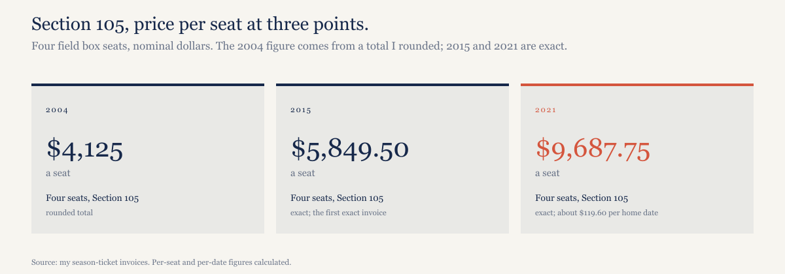
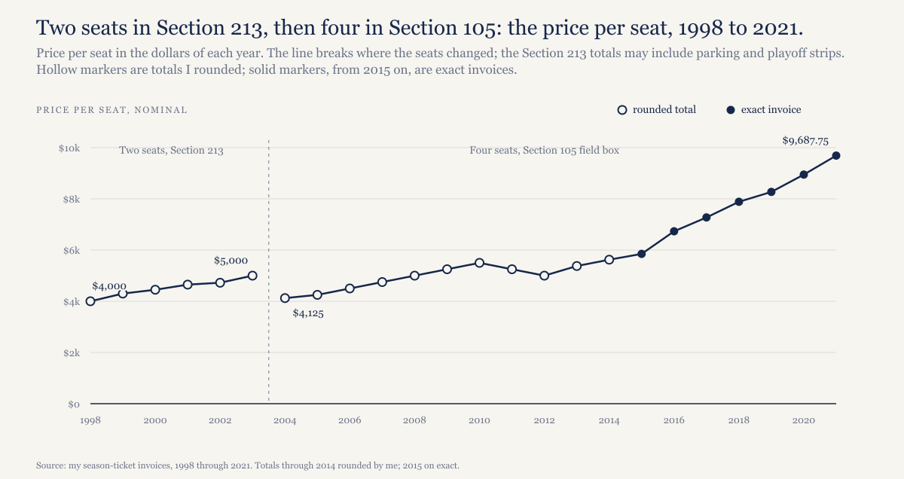
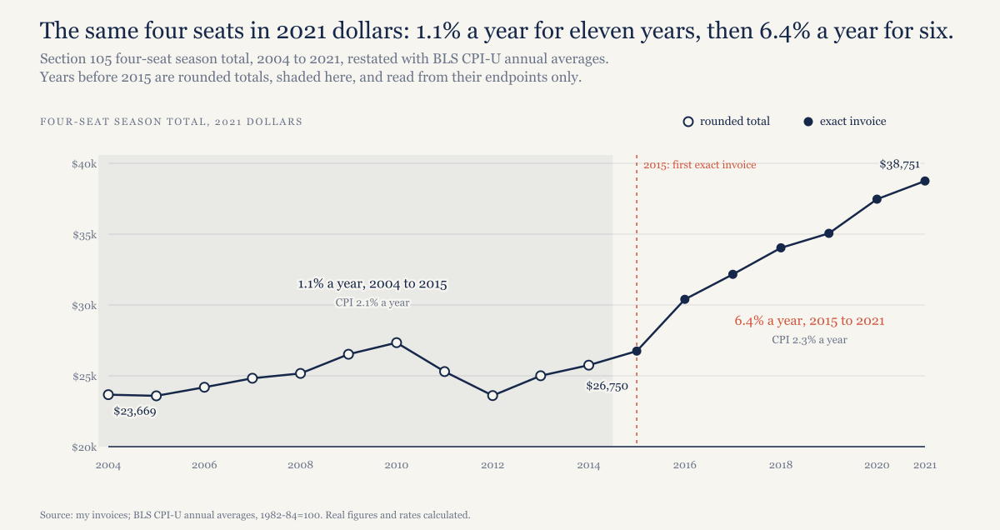
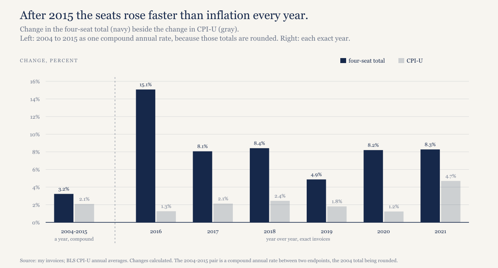

# I paid for the same four Wrigley seats for 18 years. After inflation, the price rose 13.0% in the first 11 and 44.9% in the last six.

*One fan's invoices are the only clean price series on the most opaque revenue line in baseball. Inflation ran at the same pace in both periods. The price didn't.*

---

*Construction note. The data here is mine: my Cubs season-ticket invoices from 1998 through 2021. From 1998 through 2003 I had two seats in the lower level (terrace reserved I think), in section 213. Those six totals may also include parking and playoff strips; I'm not sure, so their per-seat figures aren't comparable to Section 105's. From 2004 through 2021 I had four seats in Section 105, field box. Those are different seats, so the like-for-like series runs from 2004 through 2021.*

*The totals from 1998 through 2014 are rounded, by me, some by as much as a couple of thousand dollars. The 2015 total ($23,398) and every year after it are exact, from the invoices. So nothing below reads a single year's move before 2016; only the endpoints of the early period can carry weight. To show what the rounding does, if the 2004 total were off by $1,000 in either direction, the 2004 to 2015 growth rate would move between 2.7% and 3.8% a year before inflation and between 0.6% and 1.7% a year after it. Real figures use BLS CPI-U annual averages and are stated in 2021 dollars.*

*Disclosure: I'm a Cubs fan, I held these seats for 24 years, and I gave them up after 2021 over how the 2020 refunds were handled as well as work travel taking me out of the country. Read the 2020 section with that in mind.*

---

## The seats and the numbers

In 1998 two lower level, terrace reserved seats cost me $8,000 for the season, $4,000 a seat. By 2003 the same two cost $10,000, $5,000 a seat. Those Section 213 totals may include parking and playoff strips, so don't set them beside what follows. In 2004 I moved to four field box seats in Section 105 at $16,500, which is $4,125 a seat. By 2015, the first year I have an exact invoice, the four cost $23,398, or $5,849.50 a seat. In 2021, the last year I held them, they cost $38,751: $9,687.75 a seat, or about $119.60 a seat for each of the 81 home dates.

*[Caption: figures/captions.md, fig-04-stat-tiles]*

I bought playoff tickets twice, $7,510 in 2015 and $8,430 in 2016. Nothing else in this piece counts them.

*[Caption: figures/captions.md, fig-01-per-seat]*

## Eleven years near inflation, 2004 to 2015

The four seats went from $16,500 in 2004, a rounded figure, to $23,398 in 2015, an exact one. That's 3.2% a year before inflation; CPI over the same eleven years ran 2.1% a year. In 2021 dollars the seats went from $23,669 to $26,750, up 13.0% in total, or 1.1% a year. A little ahead of inflation, and not much more.

My spreadsheet shows the total dipping in 2011 and again in 2012. I'm not going to tell you what those dips were, because the numbers for those years are rounded and a rounding of a couple of thousand dollars is bigger than the dip. The Cubs did cut some prices in that stretch; ABC7 reported in November 2015 that from 2011 through 2014 the club "mostly held season ticket prices flat, or in some case decreased them." Whether my section was one of the decreases, the invoices as I kept them can't say.

What the Cubs were selling in those years is a matter of record. Baseball Reference has them at 75-87 in 2010, 71-91 in 2011, 61-101 in 2012, 66-96 in 2013 and 73-89 in 2014, with home attendance falling from 3,062,973 in 2010 to 3,017,966, then 2,882,756, then 2,642,682 in 2013, before a small recovery to 2,652,113 in 2014. Five losing seasons, and roughly 420,000 fewer fans through the gates in 2013 than in 2010.

The Ricketts family took control of the club on October 27, 2009, when the sale from Tribune Company closed (Ballpark Digest, that day). The first price move on record under them came before the 2015 season, when the Cubs raised prices on their best lower-bowl sections, including field box infield; Bruce Levine at CBS Chicago called it the first increase in four years and put the premium-seat average at 6.3% (September 5, 2014). My 2014 figure is rounded, so I can't say what that did to my own invoice. The across-the-board increase came a year later.

## Six years at 6.4% a year above inflation, 2015 to 2021

Same seats, same section, exact invoices from here on. In 2021 dollars the four seats went from $26,750 in 2015 to $38,751 in 2021, up 44.9%, or 6.4% a year. CPI ran 2.3% a year over those six years, against 2.1% a year in the eleven before. Inflation was the same. The price wasn't.

Year by year, before inflation: 15.1% for 2016, 8.1% for 2017, 8.4% for 2018, 4.9% for 2019, 8.2% for 2020 and 8.3% for 2021.

*[Caption: figures/captions.md, fig-02-real-total]*

The 2016 increase is the one the Cubs explained in public. On November 16, 2015, ABC7 reported an average season-ticket increase of 10.4%, tied to the 97-win season and the trip to the National League Championship Series. Club box infield, the most expensive seats in the main bowl, rose 12.8% to an average of $117.87 a game; the cheapest seats, upper deck reserved outfield, rose 13.7%; and the club carved a new "terrace box corner" section out of terrace reserved. My seats rose 15.1%, from $23,398 to $26,924.80, both exact. I can't tell you which tier Section 105 fell into, because the Cubs priced by tier and by game by then and the tier names for my section aren't in anything I kept, so the honest comparison is to the announced average, and my increase ran about five points above it. The next year it ran below: ABC7 put the 2017 average at 19.5%, with infield box up 31%, and my seats went up 8.1%.

Here is what happened in those years, as a timeline and not as a cause. The Cubs won 97 games in 2015 and reached the NLCS. They won the World Series in 2016. The 1060 Project, the renovation of Wrigley Field, was proposed in January 2013, approved by the City Council on July 24, 2013, broke ground on October 11, 2014, and wrapped up its large-scale work with the 2019 home opener, per Ballpark Digest. Marquee Sports Network, the team's own channel, launched on February 22, 2020.

My judgment, and I'm labeling it as that: the price followed the winning up and didn't come back down when the winning stopped. The invoices can show the timing. They can't show the reason, and I'm not going to pretend they do.

*[Caption: figures/captions.md, fig-03-price-vs-cpi]*

## 2020

The 2020 invoice was $35,790, up 8.2%, for a season that was played without fans. It was refunded.

The Cubs published their terms. For games originally scheduled in March, April and May, the club's season-ticket FAQ promised refunds within two weeks for credit cards and four weeks for checks; for June games, three weeks and four weeks. On July 2, 2020, the FAQ extended the same choice to the 40 home games originally scheduled for July, August and September: a credit plus a 5% bonus, or a refund, with the same three-week and four-week timing, counted from that day's ticket update email, and a July 9 deadline to change your selection. Whatever a holder had chosen for June was applied automatically to the rest of the season.

My experience matched the first part. The first batch of refunds reached me within 30 days. Everything after that took many months, by my account; I don't have exact dates, so I won't invent them. What I can say is that the published terms covered the whole season and the timing I got didn't match them for the second half of it.

One documented difference between clubs: what you got for leaving the money with the team. The Cubs offered a 5% bonus on credit. Cleveland and the Red Sox offered 10%, and the Twins 15%, according to the Associated Press on April 29, 2020. Friends who held seats elsewhere told me their refunds came faster. That's anecdote, and I'm leaving it at that.

## Why I stopped

I gave the seats up after 2021, 24 years after the first invoice. From 1998 through 2021 I paid $491,330.80 for season tickets before refunds, and $15,940 more for playoff tickets. Take out the 2020 season that came back and it's $455,540.80 that stayed with the club.

I didn't quit over the price. The price went up 44.9% in real terms in six years and I kept paying it. I quit over 2020, over paying $35,790 in advance for games that didn't happen and then waiting many months for the back half of it. Additionally, the demands of work travel, my friends and their work travel made it difficult to attend all the games. The seats were the same seats. The relationship wasn't.

## Where this money goes, and the lockout

Season tickets are local revenue, and local revenue is the part of baseball's money the clubs share with each other. The 2022–2026 Basic Agreement, in Article XXIV, sizes the revenue sharing plan each year as what "a 48% straight pool plan using the Clubs' Net Local Revenue from the prior year" would transfer. A straight pool means every club pays in the same share of its net local revenue and every club takes an equal slice out, so a high-revenue club like the Cubs puts in far more than it gets back. Nearly half of what my invoices paid for, after stadium expenses, went into that pool.

The owners' proposal of May 28, 2026 would cap 2027 payrolls at $245.3 million, counting $20.1 million of benefits and the pre-arbitration bonus pool, set a $171.2 million floor, and split revenue 50-50 with the players, per the Associated Press that day. The same proposal would end the clubs' current revenue-sharing plan and pool local media money equally instead. Ticket money stays where it is. The fight this winter is over the players' share. The fan's side of the ledger, what I paid and how fast it came back when there were no games, isn't on the table and never has been.

That sets up the next piece in this run: whether a salary cap makes a franchise worth more, which the NHL has been testing since 2005.

## What would make this wrong

One set of seats isn't the market. A fan in the bleachers or the upper deck saw a different path, and the 2016 increases varied by section; ABC7 reported the following December that they had ranged from 7% to 43%. My 15.1% sits inside that range, nearer the bottom than the top.

The rounding before 2015 blurs single years, which is why the early period is stated as endpoints and why the construction note shows how far a $1,000 error in 2004 moves the rate.

The Cubs re-tiered sections over this period; 2016 alone added terrace box corner. If Section 105 was reclassified at some point, part of a jump is a tier change rather than a price change for the same seat, and I have no document that would show it.

The 2020 and 2021 per-game figures are distorted: 2020 was shortened and played without fans, and early 2021 ran under capacity limits. The $119.60 per home date for 2021 divides by a full 81 home dates, which is the schedule, not necessarily the number of games I could have attended at full capacity.

And this is one fan's account of one club's refunds, written by someone who left over them. I've put the Cubs' published terms beside my experience so you can weigh both.

## What this predicts

The Cubs' 2027 season-ticket renewal prices go up even with a lockout threatening the season, and the renewal terms say nothing about refund timing for canceled games. Checkable when the renewals go out, and it's going in the predictions log.

## The data

Two files and a script, in [`wrigley-season-tickets-2026/`](https://github.com/mgag70-prog/hqsports-research/tree/main/wrigley-season-tickets-2026). `data/cubs-season-tickets.csv` has one row per season, 1998 through 2021, with the seat count, the section, the season total, any playoff total, and a precision flag that says whether the total is rounded or exact. `data/cpi-u-annual.csv` is the BLS CPI-U annual average for each year. `model/recompute_outline.py` computes every figure above from the two files, including the sensitivity of the early rate to the 2004 rounding.

Take it and check the work. The invoices are mine, so the one thing you can't check is whether I copied them right; everything after that step is in the repository.

---

## Not for publication: alternate titles

1. My Cubs tickets kept pace with inflation until 2016. Then they didn't.
2. Twenty-four years of Cubs season-ticket invoices, and the year the price changed.

The second alternate understates the first period slightly, since 1.1% a year real is a little ahead of inflation, not level with it.
